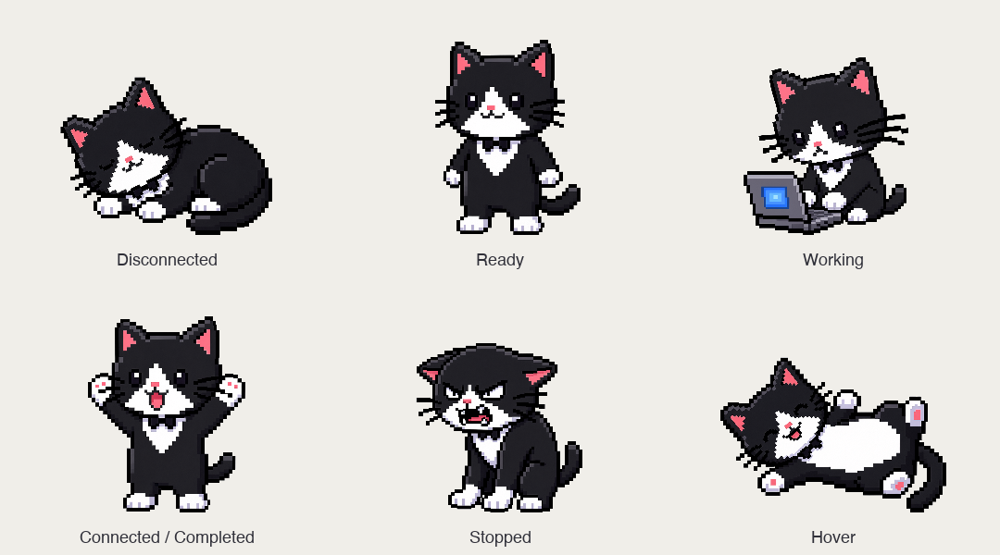

# PRD: CoPo Companion

**Status:** Draft for product review · **Version:** 0.1 · **Date:** September 25, 2026

**Scope:** Merge Companion’s desktop experience into CoPo on macOS. This document specifies the integration; it does not implement it.

## 1. Product direction

CoPo opens with the tuxedo cat. Clicking the cat opens a compact tool-connections dashboard, adapted from Companion’s current dashboard. A circular account thumbnail at the top shows the active GitHub/Copilot identity and opens account controls, Settings, Language, and Logs.

The cat makes three things visible without opening a window: whether anything is connected, whether a tool is working, and whether its task finished or stopped. The connection dashboard supplies the names, explanations, and actions behind those expressions.

**Confirmed product decision:** Happy after execution means **the whole task finished**, not one AI request finished. Connection success has its own brief celebration using the same artwork.

The direction works because the pet becomes a useful status surface. Its expressions must follow trustworthy events; a cute but inaccurate “done” signal would undermine the product.

## 2. Goals and boundaries

### Goals

- Make the companion the first visible surface on desktop launch.
- Let users see their active account and connect a supported tool from one compact panel.
- Make idle, working, disconnected, completed, and interrupted states understandable at a glance.
- Preserve the approved cat artwork, proportions, hover behavior, and motion accessibility.
- Reuse CoPo’s authentication, routing, settings, and client integration logic.

### First-release boundaries

- macOS desktop integration first; CLI behavior remains compatible.
- One CoPo application owns the pet, dashboard, settings, and gateway process.
- The old focus timer, break timer, task checklist, and daily focus total are removed from the merged dashboard. Their animations are reassigned to gateway activity.
- No automatic migration of Companion productivity history into CoPo.
- No additional model provider, remote gateway service, or new account system.
- No screen reading or prompt inspection to guess task progress.
- Whole-task celebrations are available only for tool integrations that provide a reliable task lifecycle signal. Other connections remain useful but show their monitoring limitation.

## 3. What exists and what must change

This inventory is based on the current local source, including work not yet committed. Older design documents contain obsolete bundling and startup details; implementation must follow the current source.

| Capability | Current foundation | Integration work |
|---|---|---|
| Desktop cat and poses | Companion’s Swift/AppKit renderer and supplied PNG layers | Bring the artwork and animation behavior into CoPo’s desktop shell |
| App startup | Tauri installs the tray, shows a splash, then starts its Bun gateway sidecar | Replace the normal splash with the companion; keep recovery and Quit accessible |
| Account identity | Auth status includes login and optional avatar URL; account registry supports switching | Present the active identity in the panel header and reuse its account actions |
| Tool configuration | Existing Apps integrations and named API connection keys | Combine setup and status in one tool-connections panel |
| Request activity | Per-key `working`, `finished`, `stopped`, and active request count | Feed a shared state controller; preserve individual outcomes and concurrent activity |
| Whole-task lifecycle | No general production task-completion contract found in the reviewed code | Add tool adapters and explicit task events; do not reinterpret request completion as task completion |
| Settings, language, logs | Existing desktop surfaces and localization catalogs | Expose them from the avatar menu; retain their underlying behavior |

The repository’s development Stop hooks run repository checks; they are not evidence that connected client tasks can already report completion.

## 4. Definitions

| Term | Meaning in this product |
|---|---|
| Account | The active upstream GitHub/Copilot identity, including its host |
| Tool connection | A downstream app or custom client configured to use CoPo |
| Connected / ready | An enabled tool route that passed verification, with usable account authorization and a healthy gateway; it may currently be idle |
| Configured, unverified | Setup or a key exists, but the route has not been validated; this is not yet “Connected” |
| Request | One inference call observed by the gateway |
| Task | A tool-reported unit of work with an ID and explicit lifecycle, potentially containing many inference calls and local actions |
| Waiting | An unfinished task needs user input or approval; it has not failed |
| Stopped | A task was cancelled or failed before completion, or a request was interrupted where only request-level monitoring is available |

Creating an API key, seeing an app process, or receiving a health check does not establish a working tool connection. Signing into an account alone does not mean a downstream tool is connected.

## 5. Primary experience

### A. Launch and first connection

1. Launch CoPo. The menu-bar control and companion appear; the main dashboard stays closed.
2. The companion assets load locally, before gateway startup or network authentication finishes. Initial copy says “Starting CoPo…” rather than claiming a connection is ready.
3. With no ready tool connections, the cat sleeps. On first launch, a quiet one-time hint says “Click me to connect your tools.” The hint dismisses on interaction and is not repeated on every launch.
4. Clicking the cat opens the compact dashboard beside it. Clicking again or pressing Escape closes the panel; this does not stop CoPo.
5. If signed out, the panel offers **Sign in with GitHub**. Reuse the existing supported sign-in flow. After successful account validation, the header updates to that identity and the panel offers **Add a tool**.
6. The user chooses a supported integration or a custom API connection. Apply the integration’s existing setup and verification process. Do not display success before verification passes.
7. A newly verified tool shows “Connected.” The cat briefly celebrates, then stands when ready and idle. If work has already started, it moves directly to working after or instead of the brief celebration.

Returning users see the companion first as well. Restore their account and configured connections, reconcile live state, then show the appropriate pose. Do not replay historical connection or task celebrations on launch.

If startup fails, the companion remains clickable and opens a local recovery surface with Retry, Diagnostics, and Logs. A failed sidecar must not leave a blank or unusable window.

### B. Tool-connections dashboard

Retain Companion’s compact, approachable panel and replace the productivity content with connection controls. Use a short vertical list, not a dense grid of nested cards.

```text
  CoPo                         (account photo ▾)
  Connected as account-name · host

  Your tools                         + Add a tool

  [tool icon] Claude Code             Working
              1 task running

  [tool icon] Codex                   Connected
              Ready when you are

  [tool icon] Custom client           Configured
              Verify connection

  Gateway ready · 2 tools connected
```

Rows show the tool icon/name, connection status, activity status, and the next useful action. Selecting a row opens its details: verification, routed model where known, monitoring capability, last outcome, and disconnect or reconnect controls. Details may link to existing advanced settings.

The first release exposes integrations already supported by the live registry and their available variants. Examples include Claude Code, Claude Desktop, Codex CLI/Desktop, and Copilot CLI. Verify each integration’s actual availability; do not present a planned integration as ready. Custom clients use named connection keys and clear setup instructions.

Use a stable connection ID linked to its routing configuration and API-key ID. If several tools share a key, label that activity as shared/unknown until attribution is available. Do not invent which app made a request. Where supported, recommend a separate connection key per tool.

An installed app, configured route, authenticated account, and recent traffic are separate facts. The dashboard must not collapse all four into a green dot.

### C. Account thumbnail and menu

The circular thumbnail represents the **active upstream account**, not a connected tool or the most recently used saved account. Show the login and host beside it or in its accessible label. Use the supplied avatar URL when available; if missing or unavailable, show initials or an account icon.

Clicking the thumbnail opens:

```text
  account-name · github.com
  Account                         → manage / switch / sign out
  ─────────────────────────────────
  Settings                        → Endpoint
                                    Models
                                    API keys
                                    Diagnostics
  Language                        → System / available languages
  Logs
```

- The same menu remains available when signed out, using a neutral account icon and a Sign in entry.
- Settings opens a secondary surface so advanced configuration does not crowd the connections panel.
- Model configuration stays inside Settings; do not add a duplicate Inference
  configuration item to the companion menu.
- Account switching uses the existing validation and sidecar restart behavior. Do not silently change account identity during active tasks: offer to wait, or explicitly stop work and switch.
- Only show the new account as active after the switch succeeds. A failed switch keeps or restores the previous usable identity and explains the result.
- Language reuses CoPo’s existing locale selection and updates both native and web surfaces. New copy follows the current catalog conventions.
- Logs opens the existing logs surface/folder action. A richer filtered activity view is optional later, not assumed to exist today.

### D. Hover and desktop controls

Hover shows the approved belly-up pose with paw movement, tail movement, and hearts. Moving away recomputes the current state. Hover never pauses work, resets reaction timers, or marks a connection healthy.

Retain dragging, saved placement, menu-bar access, and Show/Hide Companion. The pet stays within visible screen bounds after display changes. Clicking and dragging remain distinct gestures. Closing the dashboard or hiding the pet does not quit the gateway.

Keep one stable interactive area across poses to avoid hover repeatedly entering and leaving as the silhouette changes. Status text and tool rows remain accurate while the hover pose is visible. A blocking problem remains discoverable through a persistent status indicator and the menu bar.

## 6. Motion and state behavior



Use the approved assets and their calibrated apparent size. Preserve each original’s head, face, and proportions. Do not stretch poses to identical bounding boxes: a reclining cat should be lower and wider than a standing cat.

| Situation | Cat behavior | Visible meaning / next state |
|---|---|---|
| No ready tool connections | Sleeping; tiny head movement and gentle tail motion | “No tools connected”; stays asleep until a route is ready |
| A tool becomes verified and usable | Brief success/cheering pose | “[Tool] connected”; then standing or current activity |
| At least one ready tool, no active work | Standing; subtle arms, tail, eyes, and occasional ear fold | “Ready” |
| A reported task is running, or a real inference request is active | Focus/typing pose, facing the laptop; retain occasional scratch | “[Tool] is working” or “N tools working” |
| A task is waiting for user input | Standing with a “Needs your input” status | Do not call this stopped or completed |
| An authoritative task-completed event arrives | Happy/cheering briefly | “[Tool] finished”; then current state |
| A task is cancelled or fails before completion | Angry pose with mouth motion and bristling tail | “[Tool] stopped” with reason; then current state |
| Request-only client reports an interrupted request | Angry briefly, labelled “Request interrupted” | Does not claim the whole task failed |
| Request-only client finishes a response | Return to standing when no requests remain | “No request running”; no whole-task celebration |
| Gateway crashes or a previously usable connection is lost | Angry briefly, then sleeping if nothing usable remains | “Connection lost” with recovery action |
| User deliberately disconnects an idle tool | Recompute standing/sleeping | No failure reaction for ordinary idle disconnection |
| Hover | Belly-up with paws, tail, and hearts | Interaction overlay; underlying work continues |

“Stopped” does not mean the gateway is simply listening without traffic. A user cancellation of active work counts as stopped, as requested. A normal disconnect while idle is housekeeping.

### Timing and priority — proposed defaults

- Happy/connection celebration: 10 seconds, extended so the pose
  has time to be seen. Whole-task celebrations use the same hold and require a
  validated lifecycle event from the local adapter. Angry reaction:
  4 seconds.
- New active work interrupts a celebration immediately. Repeated polls do not restart an existing reaction.
- Running work has priority over another tool’s completion or isolated request failure. Show that other outcome in its row and the panel summary; do not imply every tool stopped.
- An event that makes the entire gateway unavailable takes priority over stale working state.
- When several tasks end together, show one aggregate reaction. If any ended unsuccessfully, show the stopped result with a count; do not overwrite it with the last success received.
- Do not queue old celebrations to replay after unrelated work finishes or after hover ends.
- For a tool-reported task, keep focus through request gaps and local tool execution until an explicit waiting, stopped, or completed event arrives.
- For request-only monitoring, a short settling delay of up to 1 second may reduce standing/typing flicker. Silence never generates a task-completed event.
- Reduce Motion shows the correct static pose and static hearts. Disable tail, paws, head, eyes, ear, mouth, and heart animation rather than merely slowing them.
- Provide status text and accessible names; neither color nor animation is the only explanation.

## 7. Whole-task detection: required contract

The current activity tracker reports inference outcomes. A completed response can still be followed by file edits, shell commands, more model calls, or user approval. Therefore request completion and whole-task completion must remain distinct throughout the system.

Each supported task-aware adapter must emit a stable task ID, connection ID, lifecycle state, timestamp, and ordered event ID. Minimum events are started, waiting, resumed, completed, cancelled, and failed. Include account/session generation so messages from a prior gateway process or account cannot update the current cat.

**Completed** means the reporting tool declares that task/turn finished, including any child work it owns. A generic tool “Stop” callback must be validated against its actual semantics before mapping it to completed; the name alone is insufficient. Product completion does not certify that generated code or answers are correct.

Adapters may use a supported client lifecycle hook or local integration API. Capability must be verified separately for each tool. No assumption is made that Codex Desktop or another client exposes these events today.

For clients without that contract, display **Request activity only** in connection details. Continue standing, typing, and request-interruption feedback, but withhold whole-task happiness. Do not approximate completion from an inactivity timeout, HTTP success, an empty active-request count, or process exit.

A manual “Mark finished” control, if desired later, must be clearly user-reported; it is outside the first-release scope.

## 8. Integration approach

### Application ownership

Use CoPo’s existing Tauri application as the host. Transfer Companion’s approved artwork and animation behavior into a dedicated transparent companion window, with a shared controller for the pet and dashboard. Treat the Swift renderer as the visual reference, not as a second independent application to auto-launch.

The startup/recovery shell and pet assets must be locally available even when the gateway is down. Existing gateway-backed settings can remain behind their current authenticated interfaces. Reuse CoPo’s configuration and account stores; do not create competing copies.

### Shared observable state

Keep gateway health, account validity, configured/verified connections, requests, tasks, and temporary reactions separate. Derive the display state from these inputs in one place. Both the pet and dashboard subscribe to it.

Persist user preferences, connection configuration, locale, and companion placement. Reconcile runtime state on launch; do not persist a transient “working” or “happy” pose as truth.

### Activity transport and attribution

Reuse the existing activity endpoint for snapshots. Extend the authenticated settings event channel with task and connection events plus a snapshot/reconciliation path; it currently pushes authentication changes, not the complete activity model.

Fast requests can begin and end between the current two-second polls. The companion needs ordered events or retained terminal-event records, not only the latest per-key status. Track individual outcomes so one concurrent success cannot erase another failure.

Maintain a single native/background subscription for the desktop companion. The current settings hook pauses polling when its document is hidden, which is unsuitable as the sole feed for a visible pet while settings are closed.

After an event-stream interruption, reconnect and obtain a fresh snapshot. Mark stale activity as unavailable rather than claiming tasks completed. A gateway restart or sleep/wake must clear stale request counters and reconcile task state; unavailable evidence is not a success event.

### Data boundaries

The pet and activity summary receive account display metadata, connection IDs, task/request IDs, statuses, timestamps, counts, and sanitized reasons. They do not need API-key values, account tokens, prompts, or model responses. Reuse existing secret storage and authenticated transport. Redact credentials from status messages and diagnostic exports.

Retain CoPo’s account isolation: switching or forgetting an account does not sign the user out of unrelated GitHub tools. Do not introduce new detailed request logging merely to animate the cat.

## 9. Acceptance criteria

| ID | Scenario | Required result |
|---|---|---|
| AC-01 | Clean installation, slow or absent network | Companion and tray appear before any remote response; clicking opens usable setup/recovery |
| AC-02 | Account signed in, no verified tool | Correct account thumbnail; cat sleeps; Add a tool is the primary action |
| AC-03 | Tool configuration saved but verification fails | Row explains the failure; no connection-success celebration |
| AC-04 | Tool verification succeeds | One brief celebration, then ready/standing; polling does not repeat it |
| AC-05 | A named connection makes inference requests | Cat types while active; model discovery, settings polling, and health checks do not trigger typing |
| AC-06 | Task-aware tool has several requests and local actions | No premature happiness between requests; focus remains until waiting or a terminal task event |
| AC-07 | Explicit task-completed event | One celebration for that task; duplicate or old-generation events are ignored |
| AC-08 | Client has request monitoring only | Successful responses never produce a whole-task celebration; limitation is visible |
| AC-09 | Active task cancelled, failed, or waits for input | Cancel/failure produces stopped feedback; waiting remains non-error and actionable |
| AC-10 | Two tools run; one finishes or stops | Cat continues working for the other; individual outcome remains visible |
| AC-11 | Gateway is idle, crashes, restarts, or loses events | Idle stands; loss shows recovery; stale data never produces success or endless false typing |
| AC-12 | Hover begins and ends during work | Belly-up overlay appears; leaving restores current state without changing work or replaying old reactions |
| AC-13 | Account switches successfully or fails | Thumbnail reflects the actual active identity; active work is not silently reassigned |
| AC-14 | Avatar unavailable; keyboard or screen reader used | Fallback account control works; all menu and connection actions remain accessible |
| AC-15 | Reduced Motion, light/dark mode, display resize | Correct static states, readable controls, consistent pose scale, no clipping or off-screen pet |
| AC-16 | Panel closes or pet is hidden | Gateway continues; menu bar can restore the pet and panel |
| AC-17 | Language changes; Settings or Logs selected | Correct existing surface opens and locale persists across native/web UI |

## 10. Delivery plan and release gates

1. **Validate and mock up.** Review the compact connection panel and avatar menu. Audit lifecycle support for each existing tool. Confirm the meaning and attribution of every reported event.
2. **Merge the desktop shell.** Add the local companion window, replace the normal splash, port the artwork behavior, and build the connection dashboard using existing auth/setup APIs. Retain recovery and menu-bar controls.
3. **Wire trustworthy live state.** Add the shared controller, background event subscription, connection verification transitions, concurrent request accounting, and stale-state handling. This is an internal preview with request-level visibility; it does not satisfy whole-task completion by itself.
4. **Add task-aware adapters.** Implement and verify whole-task reporting for supported clients. Publish a capability matrix distinguishing whole-task detection from request activity only.
5. **Validate and ship.** Exercise the acceptance scenarios against the packaged app, including a real multi-request task, cancellation, network loss, hover transitions, and Reduce Motion. Keep the standalone Companion project as a visual reference until parity is confirmed.

**Release gate:** At least one named supported integration must demonstrate end-to-end whole-task completion before marketing task-completion reactions. If no client offers a trustworthy signal, the full feature is blocked on adapter support, not “solved” by a timeout. Broader tool coverage can ship incrementally with honest capability labels.

## 11. Success measures and remaining decisions

Evaluate time from launch to first verified tool, setup completion rate, accuracy of state transitions against recorded lifecycle events, false or missed completion reactions, recovery after disconnect, and readability of the compact panel. Start with local QA and opt-in research; this PRD does not introduce external telemetry.

Set timing and idle-resource budgets during the shell prototype. Observe the effect of always-visible animation and background activity monitoring before expanding platform support.

Decisions still needed during implementation:

- Local Claude Code and Codex record adapters are implemented; packaged acceptance and compatibility with future client record formats remain to be verified. See [implementation scope](dev/companion-implementation.md#local-task-lifecycle--september-26-2026).
- Whether to name the cat or keep “CoPo Companion” as the UI label.
- Final reaction durations and account-header layout after an interactive prototype.

The requested companion experience intentionally changes the older design direction that limited motion to utility and avoided playful decoration. This is a bounded change for the cat and its hearts; settings remain restrained, token-based, keyboard-accessible, and fully respectful of Reduce Motion. Update the relevant design topic documents when implementing, rather than treating the older direction as a reason to omit the approved companion.

## 12. Source references

- [Current CoPo architecture](architecture.md)
- [Tauri launch and sidecar ownership](../shell/src-tauri/src/lib.rs)
- [Tool integration registry](../src/apps/registry.ts) and [tool setup routes](../src/routes/settings/apps.ts)
- [Account/auth data contracts](../src/lib/config/settings-types.ts) and [account management](../src/routes/settings/accounts.ts)
- [Per-key request activity](../src/lib/http/client-activity.ts), [stream outcome tracking](../src/lib/http/track-client-request.ts), and [activity endpoint](../src/routes/settings/clients.ts)
- [Existing settings event channel](../src/routes/settings/events.ts) and [current activity polling](../shell/src/ui/features/api-clients/useClientActivity.ts)
- [Existing settings navigation](../shell/ui/settings/index.html) and [localization](../shell/src/i18n/index.ts)
- [Companion renderer](../../Companion/Sources/BuddyArt.swift), [desktop interaction](../../Companion/Sources/PetView.swift), and [prepared artwork](../../Companion/Assets)

References into the adjacent Companion folder describe the current workspace arrangement. Bundle and document the required assets inside CoPo during implementation so distribution does not depend on a sibling checkout.
